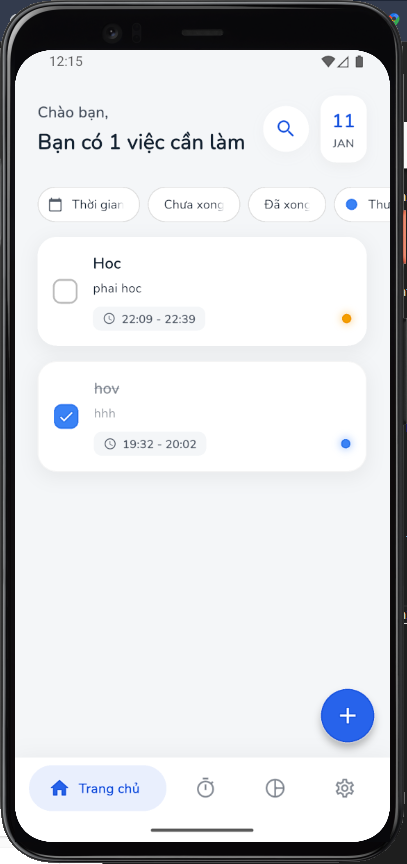
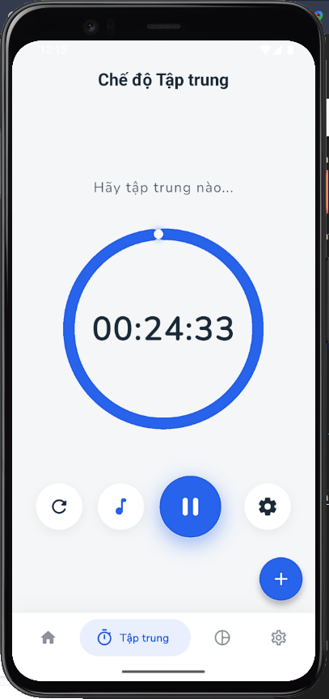
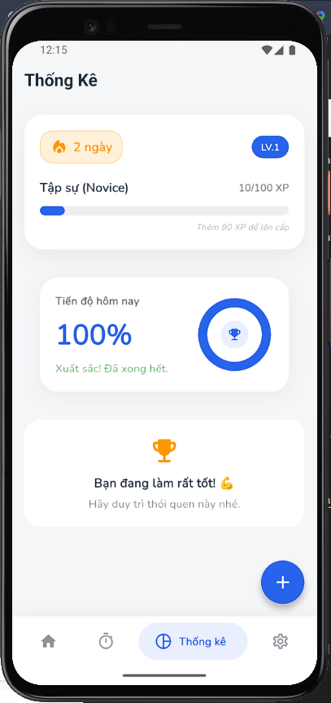

# 📝 Offline Task Planner

A **Soft Minimalist** To-Do List application built with Flutter. Designed to help you stay organized, focused, and motivated through Gamification and Pomodoro techniques.


## ✨ Features

### 📅 Task Management
- **Smart Organization:** Create, edit, and delete tasks with ease.
- **Gesture Actions:** Swipe left to delete tasks with smooth morphing animations.
- **Filtering:** Filter tasks by Date, Status (Complete/Incomplete), and Priority.
- **Search:** Real-time search functionality.

### 🍅 Focus Mode (Pomodoro)
- **Countdown Timer:** Circular visual timer to track your focus sessions.
- **Background Sounds:** Integrated White Noise player (Rain, Lofi, etc.) to boost concentration.
- **Customizable:** Adjust focus duration (15m, 25m, 60m...).

### 🎮 Gamification & Stats
- **Leveling System:** Earn XP for every completed task. Level up from "Novice" to "Master".
- **Daily Streak:** Keep the fire burning! Track your consecutive days of productivity.
- **Statistics:** Visualize your progress with beautiful charts and progress bars.

### 🎨 UI/UX
- **Soft Minimalist Design:** Clean, distraction-free interface using `Google Nav Bar`.
- **Dark/Light Mode:** Automatically adapts to system theme.
- **Responsive:** Optimized for various screen sizes (including keyboard handling).

---

## 📸 Screenshots

| Home Screen | Focus Mode | Statistics & Gamification |
|:---:|:---:|:---:|
|  |  |  |

*(Note: Please add screenshots to a `screenshots` folder in your root directory)*

---

## 🛠 Tech Stack

- **Framework:** Flutter (Dart)
- **State Management:** Provider (MVVM Architecture)
- **Local Database:** Hive (NoSQL, Key-Value pair)
- **Audio:** `audioplayers`
- **UI Libraries:**
  - `flutter_slidable` (Swipe actions)
  - `percent_indicator` (Circular/Linear progress)
  - `google_nav_bar` (Modern navigation)
  - `intl` (Date formatting)

---

## 📂 Project Structure

The project follows the **Clean Architecture** principle, separated by features:

```text
📁 lib/
├── 📁 core
│   ├── 📁 constants
│   │   └── 📄 app_colors.dart
│   ├── 📁 theme
│   └── 📁 utils
├── 📁 data
│   └── 📁 models
│       ├── 📄 task_model.dart
│       └── 📄 task_model.g.dart
├── 📁 features
│   ├── 📁 focus
│   │   ├── 📁 screens
│   │   │   └── 📄 focus_screen.dart
│   │   └── 📁 widgets
│   │       └── 📄 custom_circle_button.dart
│   ├── 📁 home
│   │   ├── 📁 screens
│   │   │   ├── 📄 home_screen.dart
│   │   │   ├── 📄 pages.dart
│   │   │   └── 📄 search_screen.dart
│   │   └── 📁 widgets
│   │       ├── 📄 filter_chips.dart
│   │       ├── 📄 highlight_text.dart
│   │       ├── 📄 statistics_card.dart
│   │       └── 📄 task_tile.dart
│   ├── 📁 settings
│   │   ├── 📁 screens
│   │   │   └── 📄 settings_screen.dart
│   │   └── 📁 widgets
│   ├── 📁 stats
│   │   ├── 📁 screens
│   │   │   └── 📄 stats_screen.dart
│   │   └── 📁 widgets
│   │       └── 📄 gamification_card.dart
│   └── 📁 task_manager
│       ├── 📁 logic
│       │   ├── 📄 task_provider.dart
│       │   └── 📄 theme_provider.dart
│       └── 📁 widgets
│           └── 📄 add_task_sheet.dart
└── 📄 main.dart

```
---
## 🚀 Getting Started

To run this project locally, follow these steps:

- Clone the repository
```text
git clone [https://github.com/nvthih24/offline-task-planner.git](https://github.com/nvthih24/offline-task-planner.git)
```
- Install dependencies
```text
flutter pub get
```
- Setup Assets
```text
assets/
  └── sounds/
      ├── rain.mp3
      └── lofi.mp3
```
- Run the app
```text
flutter run
```

---

## 🤝 Contributing

Contributions are welcome! Feel free to open an issue or submit a pull request.

---

## 📄 License

This project is licensed under the MIT License - see the LICENSE file for details.